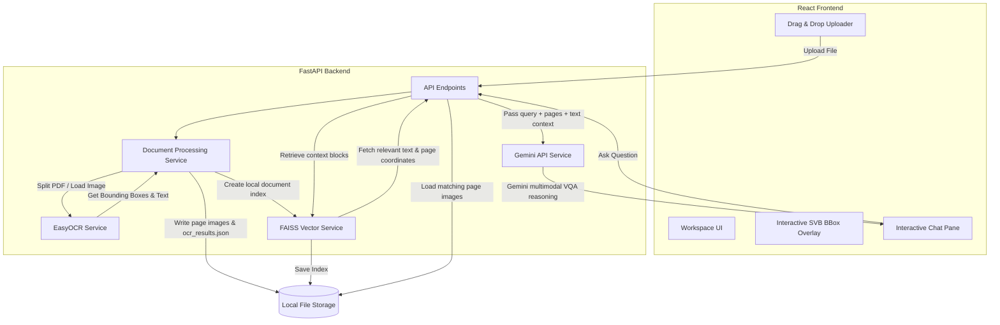

# Multimodal Retrieval-Augmented Generation (RAG) for VQA

A premium, local-first Multimodal RAG system that allows users to upload documents (PDFs, PNG, JPG, JPEG), automatically runs OCR to extract text layouts/spatial bounding boxes, indexes them semantically using a vector database, and leverages a Multimodal Large Language Model (Gemini) to perform visual and textual Question Answering (VQA).

---

## 🏗️ Architecture Design



* **Frontend**: React SPA scaffolded with Vite and styled utilizing custom Vanilla CSS variables for a high-performance obsidian/amber theme.
* **OCR Layer**: `EasyOCR` extracts textual strings along with their 4-point bounding box coordinates.
* **PDF Layer**: `PyMuPDF` (`fitz`) handles rapid page rendering and PNG extraction.
* **Vector Store**: A standalone local `FAISS` database created dynamically per document to support single-document scoped VQA queries with zero overhead.
* **Embeddings**: `SentenceTransformers` (`all-MiniLM-L6-v2`) computes 384-dimensional dense vectors for semantic search.
* **Generative AI**: OpenRouter SDK coordinates content generation passing visual context directly alongside OCR coordinates.
* **Layout scroll locking**: Static active chat headers keep uploaded document lists in place while message feeds scroll.
* **Public Chat sharing**: Allows users to snapshot and share public read-only conversation links with citations.
* **Daily Cost analytics**: SVG daily cost token charts displayed in the settings sidebar tab.

---

## 🛠️ Getting Started

### Prerequisites
* Python 3.10+
* Node.js 18+

---

### Backend Setup

1. **Navigate to the backend folder**:
   ```bash
   cd backend
   ```

2. **Activate the virtual environment**:
   ```bash
   source venv/bin/activate
   # Or create one if running manually for the first time:
   # python -m venv venv && source venv/bin/activate
   ```

3. **Install dependencies**:
   ```bash
   pip install -r requirements.txt
   ```

4. **Setup Environment Variables**:
   Create a `.env` file in the `backend/` directory:
   ```env
   GEMINI_API_KEY="your-google-ai-studio-api-key"
   GEMINI_MODEL="gemini-2.0-flash"
   HOST=0.0.0.0
   PORT=8000
   ```

5. **Start the FastAPI backend server**:
   ```bash
   python app/main.py
   ```
   The API will be available at `http://localhost:8000`. You can inspect endpoints via Swagger UI at `http://localhost:8000/docs`.

---

### Frontend Setup

1. **Navigate to the frontend folder**:
   ```bash
   cd frontend
   ```

2. **Install node dependencies**:
   ```bash
   npm install
   ```

3. **Start the Vite development web server**:
   ```bash
   npm run dev
   ```
   The React web UI will be live at `http://localhost:5173`.

---

## 🧪 Running Unit Tests

We have comprehensive unit tests verifying the OCR pipeline, vector search logic, and LLM endpoint routing.

To run the suite from the backend directory:
```bash
cd backend
PYTHONPATH=. venv/bin/pytest tests/
```