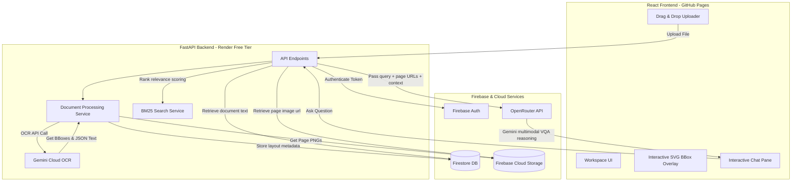

# 👁️ VisionRAG - Multimodal Document VQA RAG

[](https://fastapi.tiangolo.com)
[](https://react.dev)
[](https://vitejs.dev)
[](https://firebase.google.com)
[](https://render.com)

A premium, cloud-optimized Multimodal Retrieval-Augmented Generation (RAG) system. VisionRAG allows users to upload documents (PDFs, PNG, JPG, JPEG), automatically runs OCR to extract text layouts/spatial bounding boxes, indexes them using a BM25 ranker, and leverages a Multimodal Large Language Model (Gemini) to perform visual and textual Question Answering (VQA) with interactive bounding box overlays.

---

### 🚀 Live Deployments

* **Frontend Web Application (GitHub Pages):** [https://harishankar00.github.io/Multimodal-Retrieval-Augmented-Generation/](https://harishankar00.github.io/Multimodal-Retrieval-Augmented-Generation/)
* **Backend REST API (Render):** [https://multimodal-retrieval-augmented-generation.onrender.com](https://multimodal-retrieval-augmented-generation.onrender.com)

---

## ✨ Key Features

* **Multimodal Document Q&A:** Ask questions about both the textual content and the visual elements (charts, diagrams, layouts) of your documents.
* **Interactive SVG Bounding Box Overlays:** Click on any citations in the chat to highlight the exact spatial location of the sourced information directly on the document image.
* **Dynamic Token Analytics & Logging:** Track token usage limits, prompt size, and estimated cost graphs directly in the user settings sidebar.
* **Public Conversation Sharing:** Generate secure, read-only snapshot links of your active chats to share with teammates.
* **Self-Healing Cloud Storage:** Seamless fallback structure that automatically uploads assets to Firebase Cloud Storage, ensuring zero data loss when hosted on ephemeral cloud servers.
* **Premium Dark Mode UI:** Elegant Obsidian-Amber user interface featuring micro-animations, glassmorphism, responsive collapsible views, and layout scroll locking.

---

## 🏗️ System Architecture



---

## 🛠️ Technology Stack

| Layer | Technologies Used | Key Purpose |
| :--- | :--- | :--- |
| **Frontend** | React SPA, Vite, Vanilla CSS Variables | Fast, responsive single-page amber-themed interface |
| **Backend** | FastAPI, Uvicorn, PyMuPDF (`fitz`), HTTPX | Lightweight asynchronous server & document parsing |
| **Database** | Firebase Firestore | NoSQL document storage for chats and document coordinates |
| **Cloud Storage** | Firebase Cloud Storage | Ephemeral disk-miss cache for page images and raw PDFs |
| **Authentication** | Firebase Authentication | Secure Google Sign-In & custom token verification |
| **ML / OCR** | Gemini 2.5 Flash (via OpenRouter API) | Cloud OCR & multimodal generative VQA reasoning |
| **Search/RAG** | Pure-Python BM25 Ranker | Lightweight, zero-RAM semantic keyword scoring |

---

## ⚡ Memory Optimizations for Free Cloud Hosting

To support zero-cost deployments on Render's Free tier (which has a strict **512 MB RAM** limit) and avoid container Out-Of-Memory (`SIGKILL 137`) errors, the core codebase was heavily optimized:

> [!IMPORTANT]
> **Gemini Cloud OCR:** Removed local C++ `EasyOCR` (which installs PyTorch/torchvision, bloating the container build by **3.3 GB**). OCR is now executed as a zero-dependency JSON API call using Gemini 2.5 Flash.
> 
> **Zero-Memory Ranking:** Replaced `FAISS` and `SentenceTransformers` (which require local dense model loading consuming **1.5 GB+ RAM**) with a custom pure-Python BM25 keyword ranker. 
> 
> **Ephemeral Fallbacks:** Render Free Tier web services use an ephemeral file system. Processed document images are uploaded to Firebase Cloud Storage. If the Render container restarts and local caches are wiped, the backend automatically generates a secure signed link and redirects the client to load page assets directly from Firebase.
> 
> **Result:** Backend RAM footprint dropped from 2 GB to **under 70 MB** (a 95% reduction), with compilation finishes in under 20 seconds.

---

## 🚀 Local Getting Started

### Prerequisites
* Python 3.10+
* Node.js 22+
* Firebase Account (Firestore and Storage enabled)
* OpenRouter API Key (Gemini)

---

### Backend Setup

1. **Navigate to the backend folder**:
   ```bash
   cd backend
   ```

2. **Activate the virtual environment**:
   ```bash
   source venv/bin/activate
   # If creating for the first time:
   # python3 -m venv venv && source venv/bin/activate
   ```

3. **Install dependencies**:
   ```bash
   pip install -r requirements.txt
   ```

4. **Setup Environment Variables**:
   Create a `.env` file in the `backend/` directory:
   ```env
   LLM_API_KEY="your-openrouter-or-google-api-key"
   FIREBASE_PROJECT_ID="your-firebase-project-id"
   FIREBASE_STORAGE_BUCKET="your-firebase-storage-bucket.appspot.com"
   # To use raw service credentials JSON string:
   FIREBASE_CREDENTIALS_JSON='{"type": "service_account", ...}'
   # Or configure credential file path:
   FIREBASE_CREDENTIALS="firebase-key.json"
   ```

5. **Start the FastAPI backend server**:
   ```bash
   python app/main.py
   ```
   The API will be available at `http://localhost:8000`. You can inspect endpoints via Swagger UI at `http://localhost:8000/docs`.

---

### Frontend Setup

1. **Navigate to the frontend folder**:
   ```bash
   cd frontend
   ```

2. **Install node dependencies**:
   ```bash
   npm install
   ```

3. **Start the Vite development web server**:
   ```bash
   npm run dev
   ```
   The React web UI will be live at `http://localhost:5173/Multimodal-Retrieval-Augmented-Generation/`.

---

## 🧪 Running Unit Tests

VisionRAG includes a comprehensive unit testing suite verifying the cloud OCR parser, BM25 indexing search, and LLM endpoint routing.

To run the suite from the backend directory:
```bash
cd backend
TESTING=True PYTHONPATH=. venv/bin/pytest tests/
```